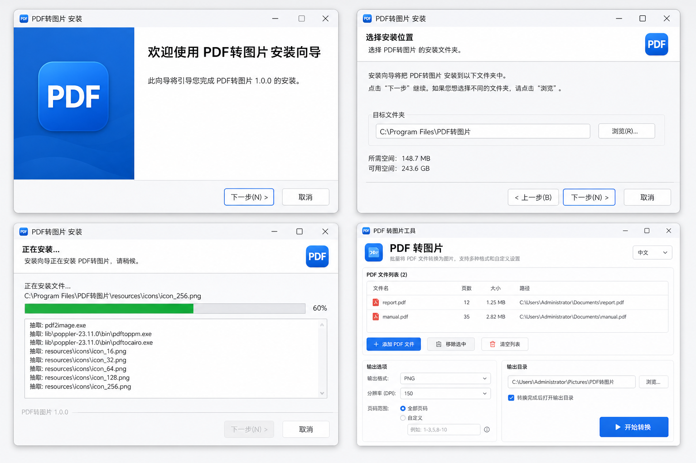

# PDF 转图片工具

一款 Windows 桌面应用，支持将 PDF 批量转换为 PNG、JPEG、BMP、TIFF、WEBP、GIF 等常见图片格式，并提供 32/64 位安装程序。

**在线首页（公开访问）：** https://leobot-cyber.github.io/pdf2pic/

## 下载

[](https://github.com/Leobot-cyber/pdf2pic/releases/latest)

| 平台 | 说明 | 下载 |
|------|------|------|
| Windows 7 SP1+ | 64 位安装程序 | [**PdfToPic_Setup_1.0.0.exe**](https://github.com/Leobot-cyber/pdf2pic/releases/latest/download/PdfToPic_Setup_1.0.0.exe) |

> 安装包公开发布在 [Releases](https://github.com/Leobot-cyber/pdf2pic/releases)，**无需登录即可下载**。推送 `main` 分支后自动构建并更新。

## 界面预览



## 功能特性

- **批量转换**：一次添加多个 PDF 文件，支持拖拽上传（Windows）
- **多种格式**：PNG、JPEG、BMP、TIFF、WEBP、GIF
- **可调分辨率**：96 / 150 / 200 / 300 / 600 DPI
- **页码范围**：可转换全部页或指定页，如 `1-5`、`1,3,5`
- **自定义输出目录**：按 PDF 文件名自动创建子文件夹
- **中英文界面**：右上角可切换语言
- **Windows 安装程序**：支持 Windows 7 SP1 及以上（32 位 / 64 位）

## 界面说明

| 功能 | 说明 |
|------|------|
| 添加 PDF 文件 / 拖拽 | 选择或拖入多个 PDF |
| 移除选中 / 清空列表 | 管理待转换文件 |
| 输出格式 | 选择目标图片格式 |
| 分辨率 (DPI) | 数值越高，图片越清晰、文件越大 |
| 页码范围 | 留空=全部；`1-5` 或 `1,3,5` 指定页 |
| 输出目录 | 转换结果保存位置 |
| 语言 | 中文 / English |
| 开始转换 | 批量执行转换 |
| 打开输出目录 | 快速查看生成结果 |

输出文件命名规则：`输出目录/原文件名/原文件名_page_0001.png`

## 开发环境运行

需要 Python 3.10+：

```bash
python -m venv venv
source venv/bin/activate        # Windows: venv\Scripts\activate
pip install -r requirements.txt
python main.py
```

## 构建 Windows 安装程序

> PyInstaller 和 Inno Setup 只能在 **Windows** 上生成 `.exe` 安装包。  
> 若你使用 macOS / Linux，请用下方 **方式一（推荐）** 云端自动构建。

### 方式一：GitHub Actions 自动构建（macOS/Linux 可用）

1. 将项目推送到 GitHub 仓库（推送 `main` 分支会自动触发构建）
2. 构建完成后，在仓库首页 **下载** 区域或 [Releases](https://github.com/Leobot-cyber/pdf2pic/releases/latest) 页面获取安装包

也可手动触发：GitHub 仓库 → **Actions** → **Build Windows Installer** → **Run workflow**

也可在终端一键触发（需安装 [GitHub CLI](https://cli.github.com/) 并登录）：

```bash
./scripts/trigger_build.sh
```

推送代码到 `main` 分支时也会自动触发构建。

### 方式二：在 Windows 本机一键构建

在 Windows 上双击或运行：

```bat
build_all.bat
```

脚本会自动完成：创建虚拟环境 → 安装依赖 → PyInstaller 打包 → Inno Setup 生成安装程序。

安装包输出路径：`installer\output\PdfToPic_Setup_1.0.0.exe`

**分步构建（可选）：**

```bat
build.bat              :: 仅打包程序
build_installer.bat    :: 仅生成安装包（需先安装 Inno Setup 6）
```

### 32/64 位说明

- 在 **64 位 Windows** 上运行 `build.bat` → 生成 64 位程序
- 在 **32 位 Windows** 上运行 `build.bat` → 生成 32 位程序
- 若需同一安装包兼容两种架构，请分别在两种系统上构建，将产物放入 `dist\x64\` 和 `dist\x86\`，再运行 `build_installer.bat`（当前脚本会优先使用与系统匹配的版本）

## 项目结构

```
pdfToPic/
├── main.py                 # 程序入口
├── src/
│   ├── app.py              # 图形界面
│   ├── converter.py        # PDF 转换核心
│   └── i18n.py             # 中英文文案
├── assets/                 # 应用图标
├── scripts/
│   └── generate_icon.py    # 图标生成脚本
├── pdfToPic.spec           # PyInstaller 配置
├── build.bat               # Windows 打包脚本
├── build_installer.bat     # 安装程序构建脚本
└── installer/
    └── setup.iss           # Inno Setup 配置
```

## 技术栈

- **PyMuPDF (fitz)**：PDF 渲染与基础格式导出
- **Pillow**：BMP / TIFF / WEBP / GIF 格式支持
- **CustomTkinter**：现代化桌面界面
- **PyInstaller**：打包为独立 exe
- **Inno Setup**：Windows 安装程序

## 许可证

MIT
